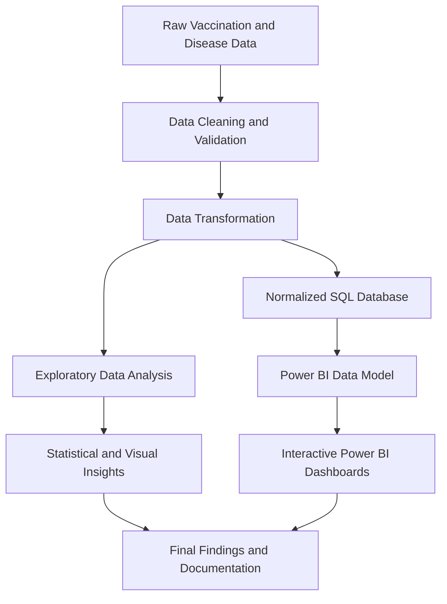
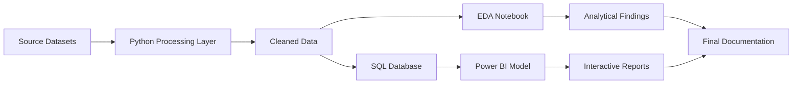
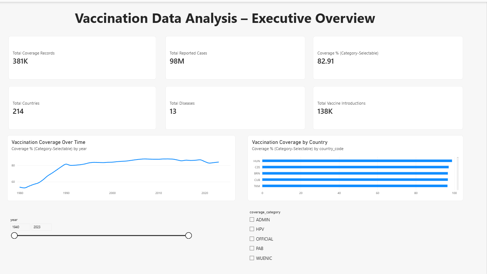
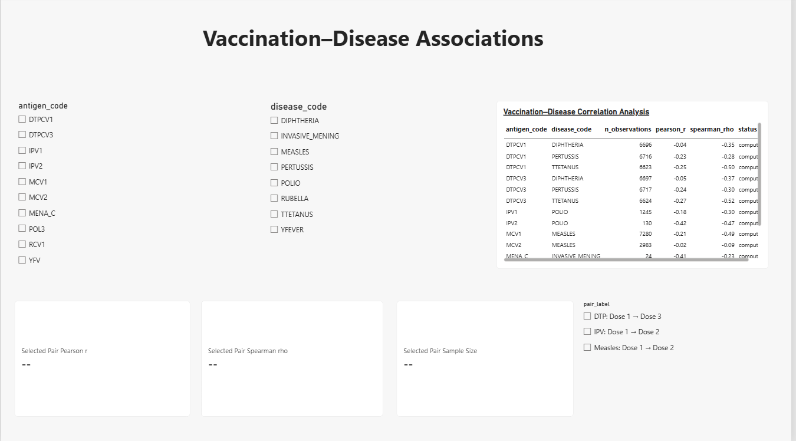
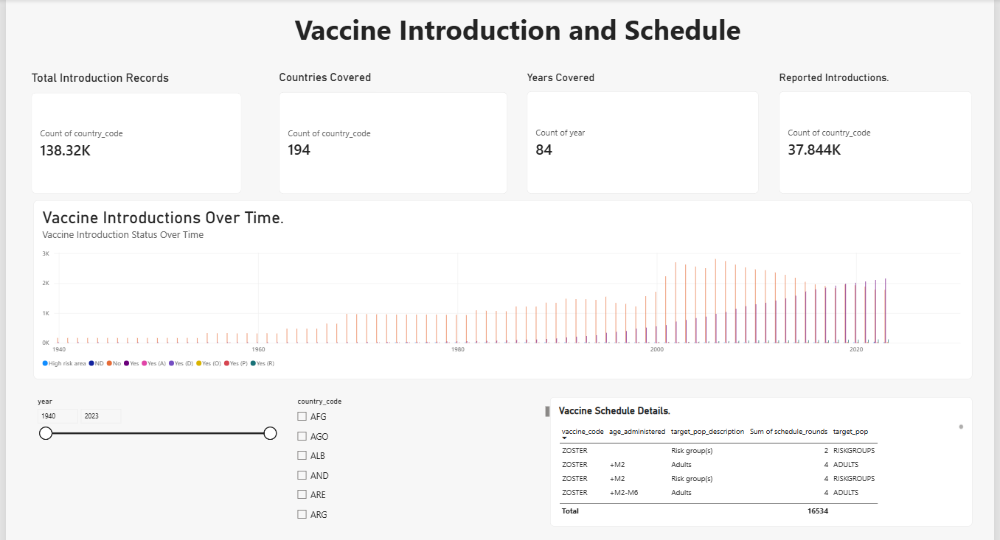
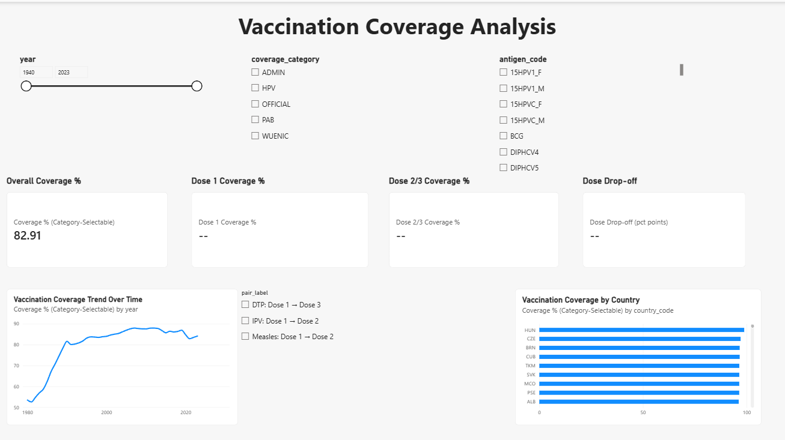
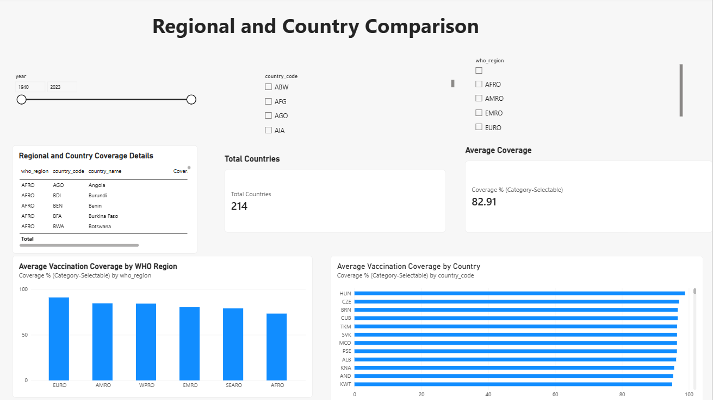
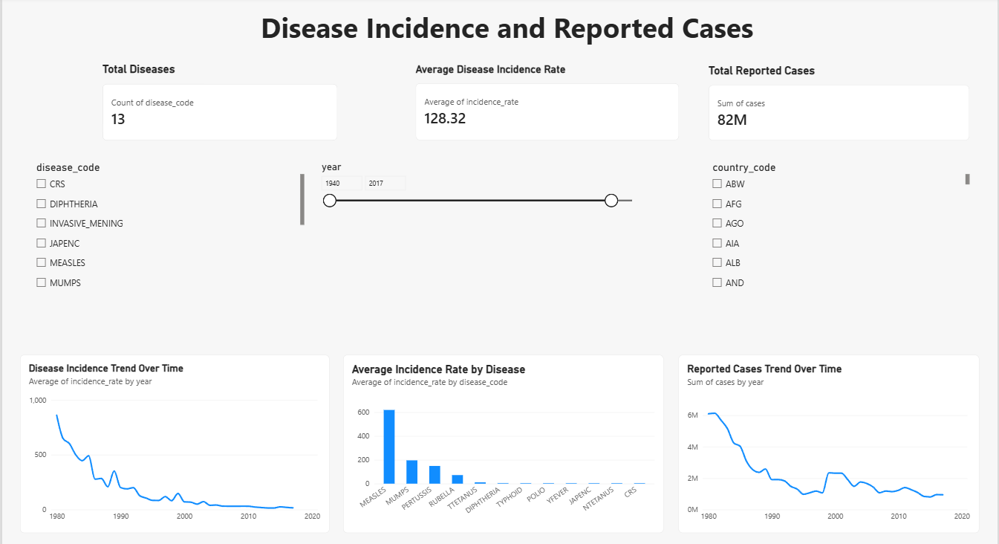
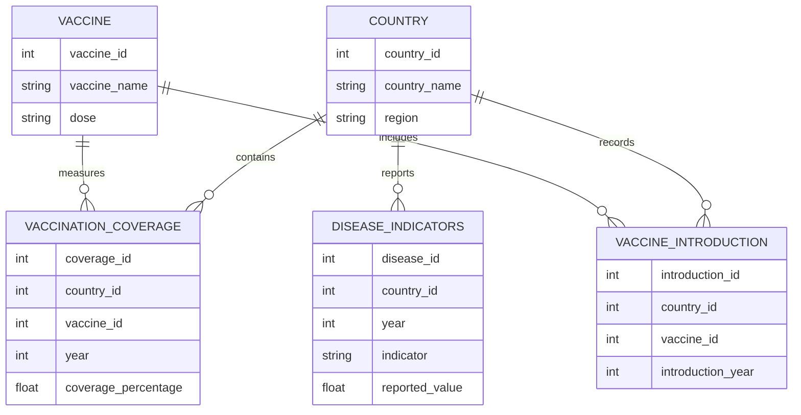
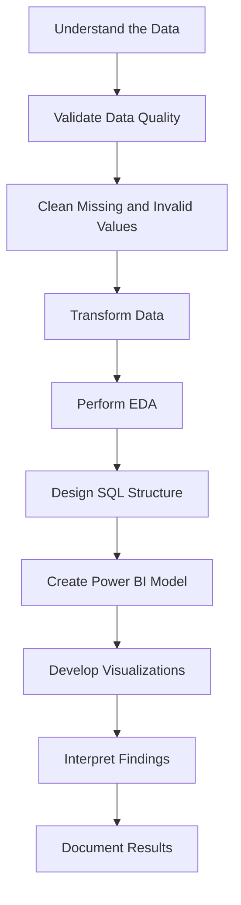

# 🌍 Vaccination Data Analysis and Visualization


## 📌 Project Overview

The **Vaccination Data Analysis and Visualization** project focuses on transforming large-scale vaccination and disease-related datasets into meaningful insights through **data cleaning, exploratory data analysis, SQL database design, and interactive Power BI dashboards**.

The project uses vaccination-related data associated with global immunization reporting sources, including WHO/UNICEF reporting datasets. It explores vaccination coverage, vaccine introduction patterns, dose-level statistics, regional differences, and reported disease indicators.

The primary objective is to develop a structured analytics workflow that converts raw data into clear, interactive, and decision-supportive visualizations.

---

## 🎯 Project Objectives

- Analyze global vaccination coverage and immunization trends.
- Identify variations in vaccination performance across countries and regions.
- Examine vaccine introduction patterns and immunization schedules.
- Compare vaccination indicators across different vaccine-dose combinations.
- Explore relationships between vaccination coverage and disease-related indicators.
- Build a normalized SQL database for structured data storage.
- Perform comprehensive exploratory data analysis using Python.
- Develop interactive Power BI dashboards for visual storytelling.
- Create reusable documentation, SQL scripts, and analytical resources.

---

## 🔄 End-to-End Project Workflow



---

## 🏗️ Project Architecture



---

## 🧰 Technology Stack

| Category | Tools and Technologies |
|---|---|
| Programming Language | Python |
| Data Manipulation | Pandas, NumPy |
| Data Visualization | Matplotlib |
| Exploratory Data Analysis | Jupyter Notebook |
| Database | SQL |
| Business Intelligence | Microsoft Power BI |
| Query Language | SQL, DAX |
| Documentation | Markdown |
| Version Control | Git and GitHub |

---

## 📊 Power BI Dashboard

The Power BI report is organized into six analytical pages:

### 1. Executive Overview

Provides a high-level summary of the vaccination dataset through key performance indicators and overview visuals.



**Main focus:**

- Total countries covered
- Total records
- Coverage-related indicators
- Overall vaccination patterns
- High-level geographical and temporal insights

### 2. Vaccination–Disease Associations

Explores relationships between vaccination indicators and disease-related information.



**Main focus:**

- Vaccine-dose comparisons
- Vaccination and disease indicators
- Country-level comparisons
- Interactive filtering
- Association-based analysis

> **Note:** Relationships observed in the dashboard should be interpreted as statistical associations and not automatically as causal relationships.

### 3. Vaccine Introduction and Schedule

Examines the introduction of vaccines and their associated immunization schedules.



**Main focus:**

- Vaccine introduction patterns
- Countries covered
- Years covered
- Vaccine-related comparisons
- Schedule-level information

### 4. Vaccination Coverage Analysis

Analyzes vaccination coverage across vaccine-dose combinations and other relevant dimensions.



**Main focus:**

- Coverage percentages
- Dose-pair comparisons
- Coverage categories
- Country and regional variations
- Interactive slicers and summary cards

### 5. Regional and Country Comparison

Provides comparative insights across geographical regions and individual countries.



**Main focus:**

- Regional performance
- Country-level comparisons
- Coverage differences
- Geographic patterns
- Comparative visual analysis

### 6. Disease Incidence and Reported Cases

Examines reported disease-related indicators and their distribution across available dimensions.



**Main focus:**

- Reported disease cases
- Disease-related trends
- Country comparisons
- Regional analysis
- Indicator-level exploration

---

## 🗃️ Database Design

The project includes SQL schema documentation for organizing vaccination and disease-related data into structured tables.

The database design focuses on:

- Data organization
- Reduced redundancy
- Logical relationships between entities
- Consistent field definitions
- Easier analytical querying
- Improved data maintainability

### Conceptual Database Flow



> The diagram represents the conceptual structure of the analytical database. Refer to the SQL schema included in the repository for the implemented table definitions.

---

## 🔬 Exploratory Data Analysis

The project includes a completed EDA notebook containing data exploration and visualization activities.

The analysis covers areas such as:

- Dataset structure and dimensions
- Missing-value analysis
- Duplicate-value analysis
- Data-type inspection
- Descriptive statistics
- Distribution analysis
- Categorical-variable analysis
- Numerical-variable analysis
- Outlier exploration
- Correlation analysis
- Country-level comparisons
- Regional comparisons
- Time-based analysis
- Vaccination indicator exploration

The EDA notebook is designed to support the findings presented in the Power BI report.

---

## 📁 Repository Structure

```text
Vaccination-Data-Analysis-and-Visualization/
│
├── 📂 docs/
│   ├── DATA_DICTIONARY.md
│   ├── PROJECT_STATUS.md
│   ├── CLEANING_TRANSFORMATION_LOG.md
│   ├── PHASE1_VALIDATION_REPORT.md
│   ├── SQL_SCHEMA.md
│   └── REPORT_SPECIFICATION.md
│
├── 📂 notebooks/
│   └── Vaccination_EDA_Completed.ipynb
│
├── 📂 scripts/
│   ├── 01_load_raw.py
│   ├── 02_clean_data.py
│   ├── 03_transform_data.py
│   ├── 04_build_database.py
│   ├── 05_generate_reports.py
│   ├── 06_export_data.py
│   └── 07_validate.py
│
├── 📂 sql/
│   └── schema.sql
│
├── 📂 powerbi/
│   ├── DAX_MEASURES.md
│   ├── BUILD_CHECKLIST.md
│   ├── REPORT_SPECIFICATION.md
│   └── VIEWING_AND_PUBLISHING_GUIDE.md
│
├── .gitignore
└── README.md
```

---

## ⚙️ Installation and Setup

### 1. Clone the Repository

```bash
git clone https://github.com/YOUR-USERNAME/Vaccination-Data-Analysis-and-Visualization.git
```

### 2. Navigate to the Project Directory

```bash
cd Vaccination-Data-Analysis-and-Visualization
```

### 3. Create a Virtual Environment

```bash
python -m venv venv
```

### 4. Activate the Virtual Environment

**Windows:**

```bash
venv\Scripts\activate
```

**macOS/Linux:**

```bash
source venv/bin/activate
```

### 5. Install Required Libraries

```bash
pip install pandas numpy matplotlib jupyter
```

### 6. Launch the EDA Notebook

```bash
jupyter notebook
```

Open:

```text
notebooks/Vaccination_EDA_Completed.ipynb
```

> The required source datasets must be available locally before executing the notebook or data-processing scripts.

---

## 🧮 Analytical Approach

The project follows a structured analytical process:



---

## 📈 Key Analytical Areas

The project investigates the following analytical questions:

- How does vaccination coverage vary across countries?
- How do vaccination indicators differ between regions?
- Which vaccine-dose combinations are available for comparison?
- How has vaccine introduction changed over time?
- What patterns can be observed in vaccination schedules?
- How are reported disease indicators distributed across countries?
- What differences exist between regional and country-level statistics?
- Which trends and variations can be identified through interactive filtering?

---

## 📌 Important Interpretation Notes

- The analysis is based on the available source datasets and their recorded indicators.
- Missing values may affect comparisons between countries or regions.
- Differences in reporting practices can influence observed results.
- Statistical association does not establish causation.
- Dashboard figures should be interpreted according to the selected filters and aggregation methods.
- Data coverage may vary by indicator, country, vaccine, and year.

---

## 🔐 Data Privacy and Repository Scope

This public repository is intended to contain project documentation, reusable scripts, SQL structures, and analytical resources.

The following materials may be excluded from the repository:

- Raw datasets
- Processed datasets
- Local database files
- Personal files
- Confidential or restricted information
- Organization-specific documents
- Files containing private or human-related information
- Large Power BI report files

The Power BI documentation and DAX reference files are included to explain the dashboard design and implementation.

---

## 📊 Power BI Report Availability

Power BI `.pbix` files are not directly rendered as interactive reports on GitHub.

To share an interactive report, the report may be published through **Power BI Service**. Before using any public-sharing option, verify that:

- The underlying data is legally permitted to be shared.
- The dataset does not contain confidential information.
- The sharing method complies with institutional or organizational policies.
- The report does not expose sensitive data through filters or downloadable information.

---

## 🚀 Future Enhancements

Potential future improvements include:

- Automating data ingestion from regularly updated sources.
- Adding more advanced statistical analysis.
- Developing predictive models for vaccination trends.
- Integrating additional health and demographic indicators.
- Creating a live data-refresh pipeline.
- Improving dashboard accessibility and navigation.
- Adding automated data-quality monitoring.
- Deploying the analytical application as a web-based platform.
- Adding role-based access to sensitive analytical resources.

---

## 👩‍💻 Project Skills Demonstrated

This project demonstrates practical experience in:

- Data cleaning and preprocessing
- Exploratory data analysis
- Data validation
- SQL database design
- Data modeling
- Business intelligence reporting
- DAX measure development
- Data visualization
- Analytical storytelling
- Technical documentation
- GitHub project organization

---

## 📚 References

The project uses vaccination and immunization-related datasets obtained from publicly available reporting sources.

Refer to the project documentation and dataset metadata for information about:

- Dataset definitions
- Data sources
- Reporting periods
- Indicator descriptions
- Data-cleaning decisions
- Transformation procedures

---

## ⭐ Acknowledgements

This project was developed as an academic and analytical data project to demonstrate the complete workflow from structured data processing to interactive business intelligence reporting.

---

## 📜 License

A license may be added according to the intended usage and redistribution requirements of the project.

If no license is specified, all rights remain with the repository owner.

---

<p align="center">
  <b>🌍 Turning Vaccination Data into Meaningful Insights</b>
</p>
